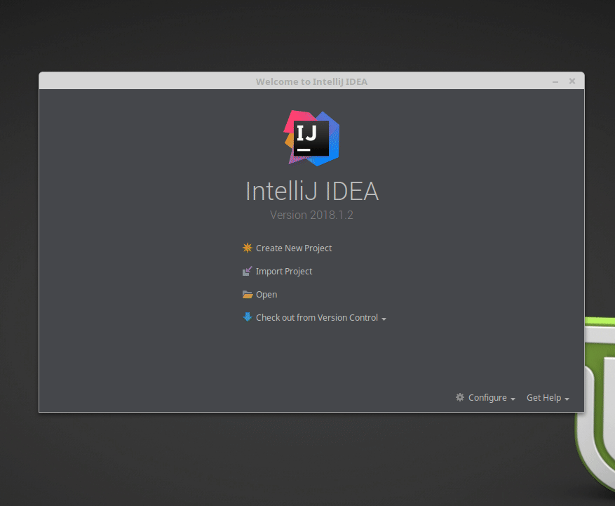
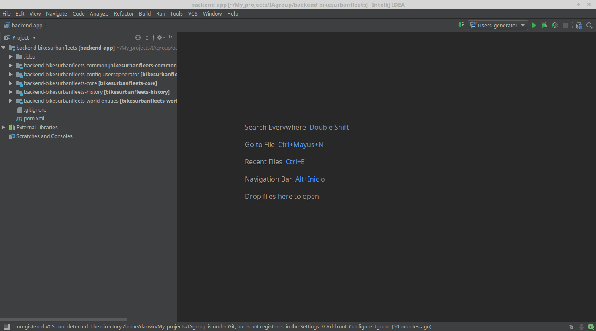
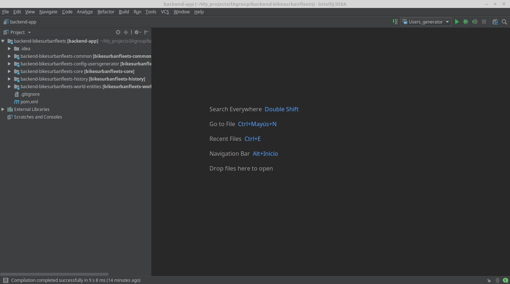

# Prerequisites
1. JDK 1.8
2. Maven 3.5
3. Node.js 8.9

Please make sure that all the binaries are registered in your PATH.

The package manager NPM is also required but is usually bundled with the Node.js installer.

# Getting Started for Development 
This project is development environment agnostic. You can use an IDE or just the command line.

## General overview of the software architecture
The project is separated in two main parts: a **backend** and a **frontend**.


The **backend** is related to all the simulation logic and is implemented in Java.

The folder `/backend-bikesurbanfleets` contains this part of the project.

The **frontend** is related to all the GUI and data analysis of the simulations. It is implemented in TypeScript, using
Angular and Electron.

The folder `/frontend-bikesurbanfleets` contains this part of the project.

## Setup

1. First of all, be sure you have all the [Prerequisites](#prerequisites) installed and working in your system.
2. Execute this in the project directory.
```
npm install && node fuse configure:dev
```

Below are recommended setups for common IDEs for **backend** and **frontend**.

The easiest option is to use the Ultimate Edition of IDEA since it is the only IDE from IntelliJ that allows having
modules of different technologies in one project. Alternatively the free community edition of IDEA can be used to
develop the Java part in IDEA and the frontend might be developed in a free webdevelopment-tailored editor like Atom or
VS Code.

## Backend - Setup IDE

# Backend Setup - IntelliJ IDEA
## Instructions

### 1. Import the project
 - Open IntelliJ IDEA. 
 - Select Import Project.
 - The folder you should select is `/backend-bikesurbanfleets/`
 - Check this checkbox: `Search for projects recursively`, `Import Maven projects automatically` and `Create module groups for multi-module Maven Projects`
 
 

### 2. Run the project with IntelliJ
As you can see this project is separated in modules. 


The module `bikesurbanfleets-config-usergenerator` generates users, and the module `bikesurbanfleets-core` simulates. 
We should create two Run Configurations, one to generate users, and the other, to simulate, in order to run our code with the IDE.

#### Users generator configuration 
- Click on `Run` &rarr; `Edit Configuration`.
- Select the button `+` &rarr; `Application` and name this Run Configuration as you want.
- Select in Main class the `Application.java` of the `backend-bikesurbanfleets-config-usersgenerator`
- Inside `Program arguments`, copy and paste the next arguments: [Users generator arguments](bikesurbanfleets-config-usergenerator_Args.md)
- Select on `Use classpath of module` the module: `bikesurbanfleets-config-usersgenerator`.
- Click `Apply`, then click `Ok`.  



#### Core configuration 
- Click on `Run` &rarr; `Edit Configuration`.
- Select the button `+` &rarr; `Application`.
- Select in Main class the `Application.java` of the `backend-bikesurbanfleets-core` and name this Run Configuration as you want.
- Inside `Program arguments`, copy and paste the next arguments: [Core arguments](bikesurbanfleets-core_Args.md)
- Select on `Use classpath of module` the module: `bikesurbanfleets-core`.
- Click `Apply`, then click `Ok`.  



## Build From Command Line
To build the backend execute:
```
node fuse build:dev-backend
```
To build the frontend and execute the GUI:
```
node fuse build:frontend
```

To build all the project:
```
node fuse build:dist
```

# Distribute
To distribute an executable or installer for your OS, just run
```
npm run distribute
```
Executables are generated in `build/dist/`

# Fundamentals

